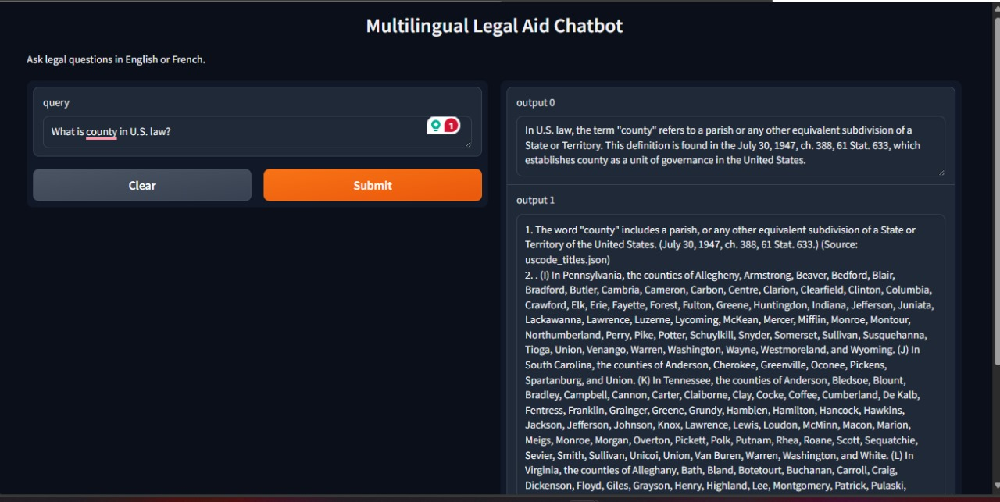
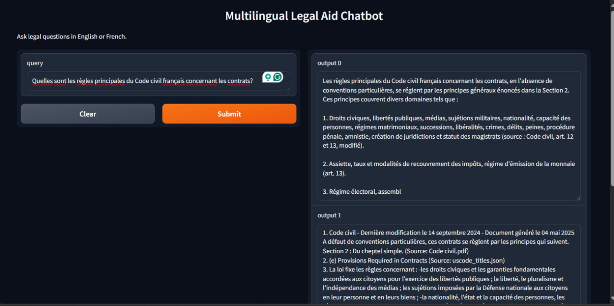

# Multilingual Legal Aid Chatbot

This repository contains a collection of Python scripts to build a multilingual legal aid chatbot, supporting English and French. The project scrapes U.S. Code data, preprocesses legal documents, creates an embedding-based vector store for retrieval, and implements a question-answering system using LangChain and a pre-trained language model (Qwen-1.5-7B-Chat). The chatbot provides accurate responses with source citations, leveraging a FAISS vector store and a Gradio interface for interaction.

## Overview
The project consists of four main components:
- **Scraping**: Extracts U.S. Code sections from `govinfo.gov`.
- **Preprocessing**: Cleans and structures legal text from PDFs, TXT, and JSON files.
- **Embedding and Retrieval**: Builds a vector store with BGE-M3 embeddings and reranks results using BGE-Reranker-v2-M3.
- **Question Answering**: Uses a RetrievalQA chain with a language model to answer queries via a Gradio interface.

## Prerequisites
- **Python**: Version 3.9 or higher
- **Dependencies**: Listed in the `requirements.txt` (to be generated based on the scripts)
- **External Libraries**:
  - `requests`, `beautifulsoup4`, `json`, `re` (for scraping)
  - `langchain`, `langchain-community`, `langchain-huggingface`, `transformers`, `sentence-transformers`, `faiss-cpu`, `torch`, `gradio`, `numpy`, `pydantic` (for preprocessing, embedding, and QA)
- **Hardware**: CPU (GPU optional for faster model inference)
- **Data**: Access to legal documents (PDFs, TXT) and pre-trained models (e.g., Qwen-1.5-7B-Chat)

## Setup Instructions
Follow these steps to set up and run the project:

1. **Clone the Repository**:
   ```bash
   git clone https://github.com/SandyHedia/Multilingual_Legal_Aid_Chatbot.git
   cd <repository-directory>
   ```

2. **Install Dependencies**:
   - Create a `requirements.txt` file based on the imports:
     ```bash
     pip install requests beautifulsoup4 langchain langchain-community langchain-huggingface transformers sentence-transformers faiss-cpu torch gradio numpy pydantic
     ```
   - Save the above line in a `requirements.txt` file in the root directory and run:
     ```bash
     pip install -r requirements.txt
     ```

3. **Prepare Data and Models**:
   - **U.S. Code Data**: Run `u.s_code_scraper.py` to generate `uscode_titles.json` in the `data/fr&en_data` directory (ensure the directory exists at `Multilingual_Legal_Aid_Chatbot/data/fr&en_data` or update the path).
   - **French Legal Documents**: Place PDF or TXT files (e.g., French legal codes) in the `data/fr&en_data` directory.
   - **Pre-trained Models**: Download Qwen-1.5-7B-Chat to `Multilingual_Legal_Aid_Chatbot/models/Qwen1.5-7B-Chat` (update paths in `retrieval_chains.py` if different).
   - **FAISS Index**: The `embedding_vector_store_and_retrieval.py` script will generate `faiss_index_bge_m3`—ensure sufficient disk space.

4. **Run the Scripts**:
   - **Scrape U.S. Code**:
     ```bash
     python u.s_code_scraper.py
     ```
     This saves scraped data to `uscode_titles.json`.
   - **Preprocess Data**:
     ```bash
     python data_preprocessing_and_cleaning.py
     ```
     This processes all files in `data/fr&en_data` and saves to `processed_multilingual_legal_data.json`.
   - **Build Vector Store**:
     ```bash
     python embedding_vector_store_and_retrieval.py
     ```
     This creates and saves the `faiss_index_bge_m3` vector store.
   - **Run the Chatbot**:
     ```bash
     python retrieval_chains.py
     ```
     This launches a Gradio interface at `http://127.0.0.1:7860`.

## File Descriptions
- **`u.s_code_scraper.py`**:
  - Scrapes U.S. Code titles (1-54) from `govinfo.gov`, cleans the text, and saves it as JSON.
  - Output: `data/fr&en_data/uscode_titles.json`.

- **`data_preprocessing_and_cleaning.py`**:
  - Processes PDF, TXT, and JSON files, extracting preambles and articles, cleaning text, and splitting into chunks.
  - Input: Files in `data/fr&en_data`.
  - Output: `processed_multilingual_legal_data.json`.

- **`embedding_vector_store_and_retrieval.py`**:
  - Loads preprocessed data, creates a FAISS vector store with BGE-M3 embeddings, and implements reranking with BGE-Reranker-v2-M3.
  - Output: `faiss_index_bge_m3`.
  - Includes example queries for testing.

- **`retrieval_chains.py`**:
  - Sets up a RetrievalQA chain with Qwen-1.5-7B-Chat and the FAISS vector store.
  - Provides a Gradio interface for interactive querying and displays answers with sources.

## Features
- **Multilingual Support**: Handles English (U.S. Code) and French (legal documents) queries.
- **Source Citation**: Includes document filenames as sources in responses.
- **Efficient Retrieval**: Uses MMR (Maximum Marginal Relevance) and reranking for relevant results.
- **Interactive Interface**: Gradio-based chatbot for real-time interaction.

## Demo
This section showcases the chatbot's functionality with screenshots from the Gradio interface. Follow the setup instructions to replicate the demo locally.

### Demo Screenshots
- **Screenshot 1: English Query**
  - Description: Shows the interface with a query like "What is the definition of county in U.S. law?" and the response with sources.
  - Image:   

- **Screenshot 2: French Query**
  - Description: Displays the interface with a query like "Expliquez l'Article 1 de la Déclaration des droits de l'homme" and the response with sources.
  - Image:   

## Notes
- **Path Configuration**: Hardcoded paths should be updated to relative paths or environment variables for portability (e.g., use `os.getenv("DATA_PATH", "data/fr&en_data")`).
- **Model Performance**: Qwen-1.5-7B-Chat runs on CPU; GPU support requires additional configuration.
- **Data Limitations**: Scraping may fail for some titles due to website structure changes—check logs and adjust `scrape_title` logic if needed.
- **Memory Usage**: The FAISS index and model files are large; ensure adequate disk space (several GBs).
- **Legal Compliance**: Ensure compliance with `govinfo.gov` terms of use for scraping U.S. Code.

## Contributing
Contributions are welcome! Please submit issues or pull requests on GitHub. Ensure changes align with the project's multilingual and legal focus.

---

   
